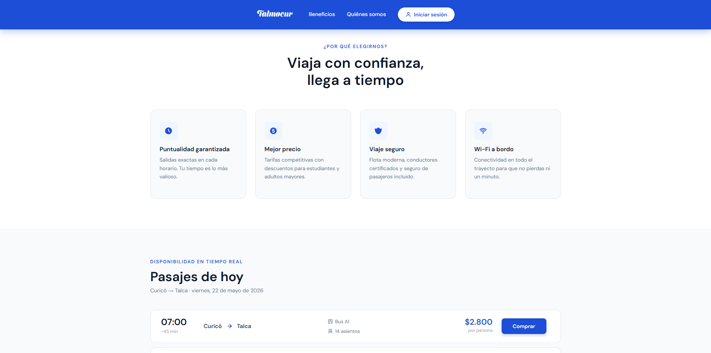
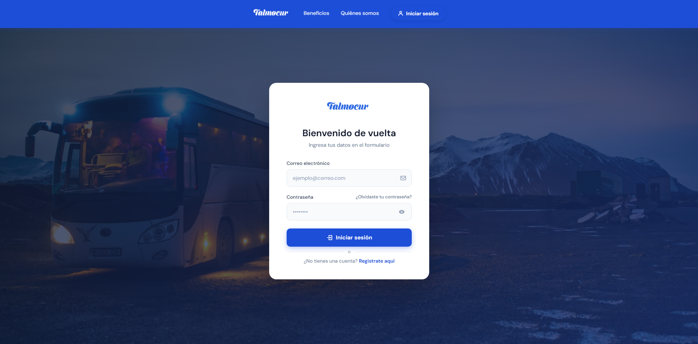
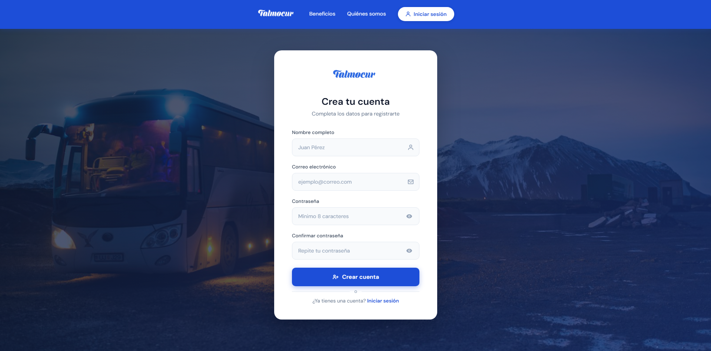

# Buses-Talmocur-Portal

Proyecto **METODOLOGIAS DE DESARROLLO Y PLANIFICACION DE PROYECTO DE SOFTWARE**, creación de portal de información y compra para redes de buses Talmocur.

## Descripción del Proyecto

El proyecto tiene como propósito desarrollar una aplicación web que proporcione información clara y actualizada sobre los servicios de buses de la compañía Talmocur. Esta plataforma estará dirigida principalmente a los usuarios del transporte, en especial a pasajeros frecuentes, quienes requieren conocer información relevante para la planificación de sus viajes. La aplicación permitirá acceder a información como rutas disponibles, horarios de salida, puntos de origen y destino, precios de los pasajes y datos de contacto de la empresa. De esta forma, se busca facilitar la toma de decisiones de los usuarios y mejorar su experiencia al utilizar el servicio de transporte. La relevancia de este proyecto radica en la necesidad de centralizar la información del servicio de buses en una única plataforma digital, considerando que actualmente la empresa no cuenta con una plataforma web oficial, lo que dificulta el acceso a esta información por parte de los usuarios.

## Objetivo

Buscamos desarrollar un portal de información, para la empresa de buses Talmocur, donde los usuarios puedan ver los horarios de salida y precios de los pasajes, además de comprarlos, sin tener que recurrir a plataformas externas como Facebook (que es la que se usa actualmente para ver los horarios de salida de los buses).

## Justificación

En la actualidad Talmocur no cuenta con una plataforma oficial donde publicar sus horarios y precios, en cambio estos se publican en plataformas como Facebook, donde no todos los usuarios pueden informarse debidamente. Este proyecto busca consolidar la información sobre los buses en un único sitio web oficial, eliminando la necesidad de que los usuarios consulten fuentes externas para obtenerla.

## Metodología

Se adoptará un enfoque metodológico basado en el desarrollo iterativo utilizando la metodología Kanban, lo que permitirá gestionar y organizar las tareas de manera eficiente mediante un tablero de trabajo. Además, el equipo se organizará en distintos roles, promoviendo el trabajo colaborativo y la distribución eficiente de responsabilidades.

## Equipo de Desarrollo

| Integrante       | Rol                                    |
| ---------------- | -------------------------------------- |
| Benjamin Hidalgo | Desarrollador                          |
| Paul Coussy      | Diseñador de Sistemas                  |
| Vicente Farias   | Gerente del Proyecto                   |
| Joaquin Vicencio | Tester                                 |
| Joaquin Paredes  | Desarrollador                          |
| Diego Pezoa      | Analista de Requisitos y Documentación |

## Tecnologías

| Tecnología    | Versión | Descripción                                         |
| ------------- | ------- | --------------------------------------------------- |
| HTML5         | —       | Estructura de las vistas                            |
| CSS3          | —       | Estilos y diseño responsivo                         |
| JavaScript    | ES6     | Interactividad del frontend                         |
| Python 🐍     | 3.12    | Lenguaje del backend                                |
| Flask         | 3.1.3   | Framework web                                       |
| Bootstrap     | 5.3     | Framework CSS                                       |
| SQLite        | 3       | Base de datos local (no requiere instalación extra) |
| SQLAlchemy    | 2.0.36  | ORM para gestionar la base de datos desde Python    |
| bcrypt        | 4.3.0   | Hashing seguro de contraseñas                       |
| python-dotenv | 1.2.2   | Gestión de variables de entorno (.env)              |
| VS Code       | —       | IDE de desarrollo                                   |

## Instalación y Ejecución

### Requisitos previos

* Python 3.12 (o superior)
* Git
* pip (incluido con Python)

> **Nota sobre la base de datos:** el archivo `data/talmocur.db` está excluido del repositorio (ver `.gitignore`). **No hay que crearlo manualmente**: la app lo genera automáticamente en la carpeta `data/` la primera vez que se ejecuta, junto con todas sus tablas y los datos iniciales (recorridos Curicó ↔ Talca).

### Pasos

1. Clonar el repositorio:

```bash
git clone https://github.com/Benjamin-Hidalgo/Buses-Talmocur-Portal.git
```

2. Entrar a la carpeta del proyecto:

```bash
cd Buses-Talmocur-Portal
```

3. (Opcional) Crear un entorno virtual:

```bash
python -m venv venv
# Windows:
venv\Scripts\activate
# macOS/Linux:
source venv/bin/activate
```

4. Instalar las dependencias:

```bash
pip install -r requirements.txt
```

5. Ejecutar la aplicación:

```bash
cd backend
python app.py
```

> Al iniciar verás uno de estos mensajes en consola:
>
> * `[BD] Base de datos nueva creada en: ...\data\talmocur.db` → primera ejecución, todo listo.
> * `[BD] Base de datos ya existente — tablas verificadas correctamente.` → BD ya existe, sin cambios.

> ⚠️ **Importante:** siempre ejecuta `python app.py` **desde dentro de la carpeta `backend/`**. Si lo ejecutas desde la raíz del proyecto, Python no encontrará los módulos correctamente.

6. Abrir en el navegador:

```
http://127.0.0.1:5000
```

### Variables de entorno (opcional)

Para configurar una `SECRET_KEY` fija (útil en producción o para mantener sesiones entre reinicios del servidor), crea un archivo `.env` dentro de `backend/`:

```env
SECRET_KEY=tu_clave_secreta_aqui
```

Si no existe el `.env`, la app genera una clave aleatoria en cada arranque (modo desarrollo).

## Estructura del Proyecto

```
Buses-Talmocur-Portal/
├── backend/
│   ├── app.py              # Servidor Flask principal (punto de entrada)
│   ├── routes.py           # Rutas API (registro, login, compras, recuperación de contraseña)
│   ├── database.py         # Conexión SQLAlchemy → apunta a /data/talmocur.db
│   ├── models.py           # Modelos ORM (tablas de la BD)
│   ├── db_sqlite.py        # Funciones CRUD para usuarios
│   ├── email_utils.py      # Funciones para el envío de correos de recuperación
│   ├── seed_db.py          # Script auxiliar para poblar la BD manualmente
│   ├── utils.py            # Funciones de validación (email, contraseña)
│   └── tests/              # Pruebas unitarias de recuperación de contraseña y edición de perfil
├── data/
│   ├── .gitkeep            # Mantiene la carpeta en el repo (la BD no se sube)
│   └── talmocur.db         # ← generado automáticamente, NO está en el repo
├── templates/
│   ├── base.html           # Template base (navbar y layout común)
│   ├── home.html           # Página principal
│   ├── login.html          # Inicio de sesión
│   ├── registro.html       # Registro de usuarios
│   ├── perfil.html         # Perfil del usuario
│   ├── compra_pasajes.html # Vista del buscador y selección de pasajes
│   ├── compra_pasajes_asientos.html # Vista interactiva de selección de asientos
│   ├── boleta.html         # Vista del comprobante/boleta de compra
│   ├── recuperar.html      # Formulario para solicitar recuperación de contraseña
│   ├── restablecer.html    # Formulario para ingresar la nueva contraseña
│   ├── admin.html          # Vista panel de administración
│   └── tarifas.html        # Página de tarifas
├── static/
│   ├── css/                # Hojas de estilo
│   ├── js/                 # Scripts del frontend
│   └── image/              # Logos e imágenes
├── requisitos.md           # Requisitos funcionales y no funcionales
├── trazabilidad.md         # Matriz de trazabilidad de requisitos implementados
├── panel_administracion.md # Documentación detallada del funcionamiento del Panel de Administrador
├── diagramaER_baseDeDatos.md  # Diagrama entidad-relación
├── docs_bd.md              # Documentación detallada de la base de datos
├── esquema_relacional_v2.md   # Esquema relacional actualizado
├── requirements.txt        # Dependencias de Python
└── README.md
```

> **La base de datos (`talmocur.db`) no está en el repositorio** y se crea automáticamente en la carpeta `data/` al ejecutar la app por primera vez.

## Modelos de la Base de Datos

La app usa **SQLite + SQLAlchemy**. Las tablas se crean automáticamente al iniciar:

| Tabla              | Descripción                                      |
| ------------------ | ------------------------------------------------ |
| `usuario`          | Cuentas de usuario (pasajeros y administradores) |
| `bus`              | Flota de buses con patente, capacidad y estado   |
| `asiento`          | Asientos físicos de cada bus                     |
| `recorrido`        | Rutas origen → destino                           |
| `horario_viaje`    | Horarios recurrentes con precio base             |
| `compra`           | Transacciones de compra de pasajes               |
| `asiento_comprado` | Asientos incluidos en cada compra                |
| `suspension`       | Bloqueos temporales de horarios                  |
| `aviso`            | Notificaciones del administrador                 |

## Estado Actual del Proyecto

El proyecto se encuentra en fase de **pruebas y estabilización de características**.

**Completado:**

* **Sistema de Autenticación & Seguridad:** Registro, inicio y cierre de sesión con cifrado bcrypt.
* **Diferenciación de Roles:** Redirecciones inteligentes del portal y restricciones estrictas de API basadas en rol (`admin` y `pasajero`).
* **Base de Datos Dinámica:** SQLite con SQLAlchemy, generación automática de tablas e inicialización de datos de prueba al arranque.
* **Buscador & Tarifas:** Carga dinámica de rutas y orígenes/destinos desde la BD; visualización de tarifas en tiempo real.
* **Panel de Administración:** Gestión integral de buses (autogeneración de asientos), control estricto de horarios y sus reglas de conflicto de tiempos, y publicación de avisos globales según vigencia. Ver [panel\_administracion.md](file:///c:/Users/dipez/OneDrive/Documentos/Universidad/Metodoogias/Proyecto/panel_administracion.md).
* **Flujo de Compra e Interactividad:** Selección interactiva de asientos según disponibilidad real y persistencia de transacciones con emisión de boletas.
* **Recuperación de Contraseñas:** Mecanismo seguro de restablecimiento de contraseñas mediante tokens por correo electrónico.

**Pendiente:**

* **Visualización de beneficios y convenios (REQ-F05):** Pestaña informativa y módulo dinámico de descuentos aplicables.

## Capturas de Pantalla

### Home

  

### Login



### Registro



## Mapa Conceptual

[Mapa conceptual](https://drive.google.com/file/d/1Pm5_oKX6ITMBmmuEn2FeNMSooOLuC1cy/view?usp=sharing)
