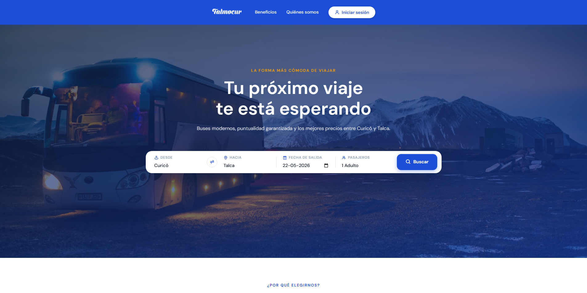
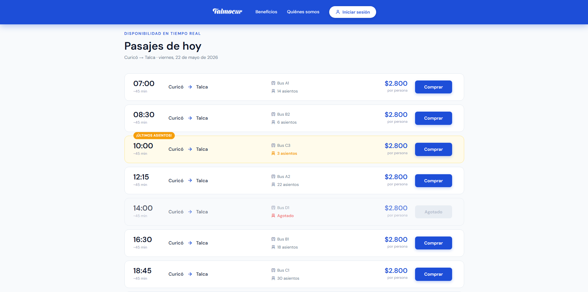

# Buses-Talmocur-Portal
Proyecto **METODOLOGIAS DE DESARROLLO Y PLANIFICACION DE PROYECTO DE SOFTWARE**, creación de portal de información y compra para redes de buses Talmocur.

## Descripción del Proyecto
El proyecto tiene como propósito desarrollar una aplicación web que proporcione
información clara y actualizada sobre los servicios de buses de la compañía Talmocur. Esta
plataforma estará dirigida principalmente a los usuarios del transporte, en especial a pasajeros
frecuentes, quienes requieren conocer información relevante para la planificación de sus
viajes.
La aplicación permitirá acceder a información como rutas disponibles, horarios de salida,
puntos de origen y destino, precios de los pasajes y datos de contacto de la empresa. De esta
forma, se busca facilitar la toma de decisiones de los usuarios y mejorar su experiencia al
utilizar el servicio de transporte.
La relevancia de este proyecto radica en la necesidad de centralizar la información del
servicio de buses en una única plataforma digital, considerando que actualmente la empresa
no cuenta con una plataforma web oficial, lo que dificulta el acceso a esta información por
parte de los usuarios.

## Objetivo
Buscamos desarrollar un portal de información, para la empresa de buses Talmocur, donde
los usuarios puedan ver los horarios de salida y precios de los pasajes, además de comprarlos,
sin tener que recurrir a plataformas externas como Facebook (que es la que se usa
actualmente para ver los horarios de salida de los buses).

## Justificación
En la actualidad Talmocur no cuenta con una plataforma oficial donde publicar sus horarios y
precios, en cambio estos se publican en plataformas como Facebook, donde no todos los
usuarios pueden informarse debidamente. Este proyecto busca consolidar la información
sobre los buses en un único sitio web oficial, eliminando la necesidad de que los usuarios
consulten fuentes externas para obtenerla.

## Metodología
Se adoptará un enfoque metodológico basado en el desarrollo iterativo utilizando la
metodología Kanban, lo que permitirá gestionar y organizar las tareas de manera eficiente
mediante un tablero de trabajo. Además, el equipo se organizará en distintos roles,
promoviendo el trabajo colaborativo y la distribución eficiente de responsabilidades.

## Equipo de Desarrollo

| Integrante | Rol |
|:-----------|:----|
| Benjamin Hidalgo | Desarrollador |
| Paul Coussy | Diseñador de Sistemas |
| Vicente Farias | Gerente del Proyecto |
| Joaquin Vicencio | Tester |
| Joaquin Paredes | Desarrollador |
| Diego Pezoa | Analista de Requisitos y Documentación |

## Tecnologías

| Tecnología | Versión | Descripción |
|:-----------|:--------|:------------|
| HTML5 | — | Estructura de las vistas |
| CSS3 | — | Estilos y diseño responsivo |
| JavaScript | ES6 | Interactividad del frontend |
| Python 🐍 | 3.12 | Lenguaje del backend |
| Flask | 3.1.3 | Framework web |
| Bootstrap | 5.3 | Framework CSS |
| VS Code | — | IDE de desarrollo |
| Base de datos | Por definir | En evaluación |

## Instalación y Ejecución

### Requisitos previos
- Python 3.12
- Git

### Pasos

1. Clonar el repositorio:
```bash
git clone https://github.com/Benjamin-Hidalgo/Buses-Talmocur-Portal.git
```

2. Entrar a la carpeta del proyecto:
```bash
cd Buses-Talmocur-Portal
```

3. Instalar las dependencias:
```bash
pip install -r requirements.txt
```

4. Ejecutar la aplicación:
```bash
cd backend
python app.py
```

5. Abrir en el navegador:
```
http://127.0.0.1:5000
```

## Estructura del Proyecto

```
Buses-Talmocur-Portal/
├── backend/
│   ├── app.py              # Servidor Flask principal
│   ├── routes.py           # Rutas de la API
│   └── utils.py            # Funciones de validación
├── templates/
│   ├── base.html           # Template base (navbar y layout común)
│   ├── home.html           # Página principal
│   ├── login.html          # Inicio de sesión
│   └── registro.html       # Registro de usuarios
├── static/
│   ├── css/                # Hojas de estilo
│   ├── js/                 # Scripts del frontend
│   └── image/              # Logos e imágenes
├── requisitos.md           # Requisitos funcionales y no funcionales
├── diagramaER_baseDeDatos.md  # Diagrama entidad-relación
├── requirements.txt        # Dependencias de Python
└── README.md
```

## Estado Actual del Proyecto

El proyecto se encuentra en fase de **desarrollo frontend**. Se completaron las vistas de Home, Login y Registro de forma visual. El equipo está a la espera de la implementación de la base de datos para comenzar con la autenticación de usuarios y la gestión de horarios y precios de buses.

## Capturas de Pantalla

### Home




### Login


### Registro


## Mapa Conceptual
[Mapa conceptual](https://drive.google.com/file/d/1Pm5_oKX6ITMBmmuEn2FeNMSooOLuC1cy/view?usp=sharing)
