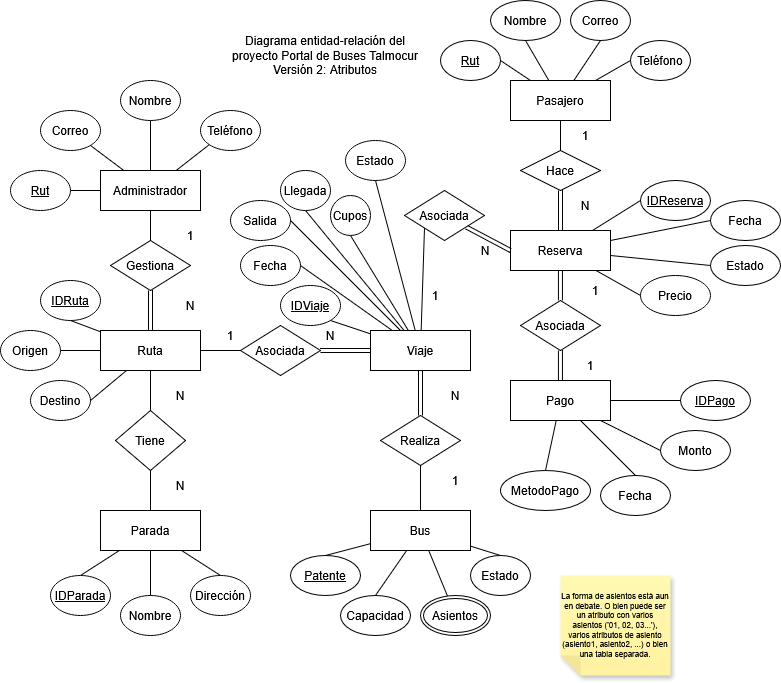

# diagramaER\_baseDeDatos

_Diagrama ER inspirado en el diagrama de clases sugerido por el profesor. Versión 2, adición de atributos para las entidades. Sujeto a cambios._

#### Conceptos de diseño de bases de datos:

* El uso de la palabra puede implica que una entidad podría o no relacionarse con otra, por ejemplo, una persona podría o no comprar productos en un sitio de supermercados, y aun así se considera un usuario. Se representa con una línea simple como las de Ruta y Parada.
* El uso de la palabra debe implica que una entidad tiene que relacionarse con otra. Por ejemplo, una boleta debe estar asociada a un solo comprador. Se representa como una línea doble, como la de Viaje hacia Bus.
* Los atributos de una entidad son representados con un óvalo simple, con una línea que conecta el rectángulo de la entidad con su atributo
* Los atributos multivaluados se representan con un óvalo doble, y son aquellos que contienen varias entradas separadas por un carácter especial o alguna otra forma (como pueden ser números de teléfono: ‘+56900303030, +56973473847, ….’)

**Tablas y Atributos:**

* Administrador: Rut\[PK], Correo, Nombre, Teléfono
* Pasajero: Rut\[PK], Correo, Nombre, Teléfono
* Ruta: IDRuta\[PK], Origen, Destino
* Parada: IDParada\[PK], Nombre, Dirección
* Viaje: IDViaje\[PK], Fecha, Salida, Llegada, Cupos, Estado (Salida y Llegada es una hora)
* Reserva: IDReserva\[PK], Fecha, Estado, Precio
* Pago: IDPago\[PK], Monto, Fecha, MétodoPago
* Bus: Patente\[PK], Capacidad, Estado, Asientos

_Observación: (La forma de asientos aún es debatida, puede ser multivaluado, con varias strings o número de asiento, o bien una tabla aparte con asociación a cada bus, y estado por viaje. Actualmente, cada bus tendrá 30 asientos como modo de simulación. Los asientos también tendran que tener alguna clase de relación con el viaje, para resetearlos una vez el bus termine uno.)_

**Relaciones:**

Administrador y Ruta: Un administrador puede gestionar varias rutas, una ruta debe ser gestionada por un administrador.

Ruta y Parada: Una ruta tiene varias paradas, y una parada puede estar en varias rutas.

Ruta y Viaje: Una ruta puede estar asociada a varios viajes, un viaje debe tener asociada una sola ruta.

Viaje y Bus: Un viaje debe ser realizado por un solo bus, un bus puede realizar varios viajes.

Viaje y Reserva: Un viaje puede estar asociado a (existir en) varias reservas, una reserva debe tener asociada un solo viaje.

Pasajero y Reserva: Un pasajero puede hacer varias reservas, una reserva debe ser hecha por solo un pasajero.

Reserva y Pago: Una reserva debe estar asociada a un solo pago, un pago debe estar asociado a una reserva. (Esto puede cambiar si se piensa en tarjetas de crédito).
