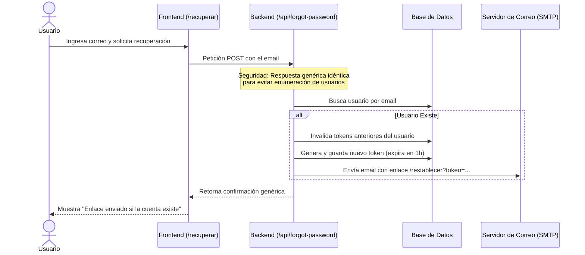

# Autenticación, Roles y Registro de Usuarios

Este documento describe el sistema de autenticación, la definición de roles y perfiles, las validaciones de datos de entrada y el flujo completo de recuperación de contraseñas de Buses Talmocur.

---

## 1. Roles y Tipos de Usuarios

El sistema distingue entre dos roles de usuario mediante el atributo `rol` en la tabla `usuario`:

### Pasajero (Cliente)
Es el rol asignado por defecto a los nuevos registros de usuario.
- **Capacidades**:
  - Buscar recorridos en tiempo real en la página de inicio.
  - Seleccionar asientos e ingresar datos de pasajeros para efectuar compras.
  - Ver el historial de pasajes adquiridos desde su perfil personal.
  - Editar su nombre y correo, o actualizar su contraseña actual.
  - Solicitar restablecimiento de contraseña en caso de olvido.

### Administrador (Admin)
Usuario con privilegios elevados encargado del control operacional de la plataforma.
- **Capacidades**:
  - Todas las capacidades del Pasajero.
  - Acceso exclusivo al **Panel de Administración** (`/admin`).
  - Registrar buses en la flota (lo que genera de forma automática sus asientos en la base de datos).
  - Cambiar el estado operacional de los buses (ej: de `"Activo"` a `"En mantención"`).
  - Programar horarios de viaje recurrentes, desactivarlos o definir sus precios.
  - Suspender la venta de pasajes en rangos de fechas específicos por motivos de fuerza mayor.
  - Redactar, programar y publicar avisos globales tipo Toast en el portal de inicio.

---

## 2. Registro de Usuarios y Validaciones de Entrada

El registro de una cuenta (`POST /api/register`) exige una validación exhaustiva tanto en el frontend (para retroalimentar al usuario de inmediato sin recargar la página) como en el backend (para asegurar la integridad de la base de datos).

### Criterios de Validación de Contraseñas ([utils.py](file:///c:/Users/dipez/OneDrive/Documentos/Universidad/Metodoogias/Proyecto/backend/utils.py))
Para garantizar que las cuentas utilicen claves robustas, la contraseña ingresada debe cumplir estrictamente con los siguientes requisitos mínimos:
- **Longitud**: Mínimo 8 caracteres.
- **Mayúsculas**: Contener al menos una letra mayúscula (`A-Z`).
- **Minúsculas**: Contener al menos una letra minúscula (`a-z`).
- **Números**: Contener al menos un dígito numérico (`0-9`).
- **Caracteres Especiales**: Contener al menos un símbolo especial de la siguiente lista: `!@#$%^&*()-_=+[]{}|;:,.<>?/`.

### Criterios de Validación de Correo Electrónico
- **Formato**: Debe cumplir con la expresión regular estándar:
  $$\text{patrón} = \text{\texttt{\^{}[\textbackslash{}w\textbackslash{}.-]+@[\textbackslash{}w\textbackslash{}.-]+\textbackslash{}.\textbackslash{}w+\$}}$$
- **Unicidad**: El backend consulta la base de datos para asegurar que el correo electrónico no esté registrado previamente por otro usuario. Si ya existe, retorna un código `HTTP 409 Conflict`.

### Confirmación de Clave
Las contraseñas de los campos "Contraseña" y "Confirmar Contraseña" del formulario deben ser exactamente idénticas (`password == confirm_password`).

---

## 3. Inicio y Cierre de Sesión

### Proceso de Inicio de Sesión (`POST /api/login`)
1. El usuario envía su correo y contraseña.
2. El backend busca el registro en la base de datos. Si no existe, se retorna un mensaje de error genérico para no dar pistas de enumeración de cuentas.
3. Se comparan las contraseñas mediante la librería `bcrypt`. Si coincide, se crea la sesión.
4. **Sesión Segura**: Flask utiliza una cookie de sesión firmada criptográficamente con la clave del servidor (`SECRET_KEY`). Esta cookie almacena de forma segura los siguientes datos en el navegador del cliente:
   - `user_id`: UUID único del usuario.
   - `user_nombre`: Nombre completo para desplegar saludos personalizados.
   - `user_email`: Correo de la cuenta activa.
   - `user_rol`: Rol del usuario (`"pasajero"` o `"admin"`).

### Proceso de Cierre de Sesión (`POST /api/logout`)
Para garantizar la seguridad en dispositivos compartidos, el endpoint de logout limpia por completo la cookie de sesión activa mediante `session.clear()`, impidiendo cualquier tipo de secuestro de sesión posterior.

---

## 4. Flujo de Recuperación de Contraseñas (Password Reset)

Cuando un usuario olvida su contraseña, el sistema implementa un flujo seguro de restablecimiento por correo electrónico:

### 4.1. Solicitud de Recuperación
- El usuario ingresa a `/recuperar` y digita su correo.
- **Protección contra Enumeración de Usuarios**: Independientemente de si el correo existe o no en la base de datos, el endpoint responde **siempre** con el mismo mensaje exitoso: *"Si el correo está registrado, te enviamos un enlace para restablecer tu contraseña"*. Esto evita que un atacante automatice solicitudes para descubrir qué correos tienen cuenta en el portal.

### 4.2. Generación e Inyección del Token
- Si el usuario existe, el backend ejecuta `db.invalidar_tokens_de_usuario` para desactivar cualquier enlace de recuperación previo que no se haya usado.
- Genera un token aleatorio seguro de 32 bytes codificado para URL mediante `secrets.token_urlsafe(32)`.
- Inserta el registro en la tabla `token_recuperacion` guardando el ID del usuario, el hash del token y una fecha de expiración fijada en **1 hora** a partir del momento actual.

### 4.3. Envío del Correo
- Se construye un enlace que apunta a la vista de restablecimiento de la aplicación incluyendo el token como parámetro de consulta (ej: `https://talmocur.cl/restablecer?token=TU_TOKEN_SEGURO`).
- El backend envía un email automatizado al correo del usuario con el enlace usando un servicio de correo SMTP.
- **Facilidad de Desarrollo (Modo Debug)**: Si la aplicación está ejecutándose en modo de desarrollo (`debug=True`) y el servidor de correos no está configurado, el backend devuelve de forma conveniente el enlace generado en el cuerpo de la respuesta JSON, permitiendo a los desarrolladores simular el flujo sin necesidad de un cliente de correo real.

### 4.4. Restablecimiento de la Contraseña (`POST /api/reset-password`)
1. El usuario hace clic en el enlace de su correo y se le redirige al formulario de restablecimiento.
2. El script de la página extrae el parámetro `token` de la URL.
3. El usuario digita su nueva contraseña y la confirmación.
4. El backend verifica en la base de datos:
   - Que el token exista.
   - Que no haya sido marcado como utilizado (`usado = False`).
   - Que la hora actual del servidor no supere la fecha de expiración del token.
5. Si pasa la validación, la nueva contraseña es hasheada con `bcrypt`, se actualiza la columna `password_hash` del usuario en la tabla `usuario` y se marca el token como `usado = True` para impedir que se vuelva a utilizar.
