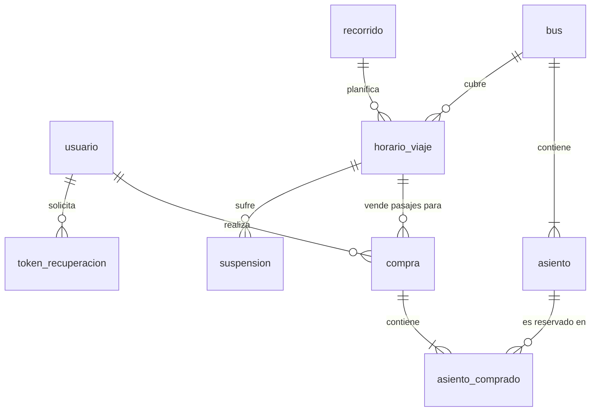

# Base de Datos y Seguridad de Contraseñas

Este documento detalla la arquitectura de la base de datos, el diseño del esquema relacional, la inicialización del sistema y los mecanismos de seguridad implementados en el portal de Buses Talmocur.

---

## 1. Arquitectura y Tecnologías

El almacenamiento y acceso a los datos del proyecto se construyen sobre dos tecnologías clave:

### SQLite (Motor de Base de Datos)
SQLite es un motor de base de datos relacional ligero que almacena toda la información del portal en un único archivo físico (`data/talmocur.db`). 
- **Ventajas en desarrollo**: No requiere instalar ni configurar un servidor de base de datos independiente (como MySQL o PostgreSQL), facilitando la portabilidad del proyecto entre los integrantes del equipo.
- **Transición a producción**: Dado que el acceso se realiza mediante un ORM, migrar a motores robustos como PostgreSQL o MySQL requiere únicamente cambiar la URI de conexión en [database.py](file:///c:/Users/dipez/OneDrive/Documentos/Universidad/Metodoogias/Proyecto/backend/database.py).

### SQLAlchemy 2.0 (ORM)
SQLAlchemy es la biblioteca de Python que actúa como *Object-Relational Mapper* (ORM). Este mapea las clases declaradas en Python a tablas de base de datos relacionales, traduciendo automáticamente las consultas orientadas a objetos a código SQL.
- **Prevención de Vulnerabilidades**: El ORM gestiona automáticamente la parametrización de consultas, lo que mitiga por completo los ataques de inyección SQL (SQL Injection).

---

## 2. Ubicación y Estado en el Repositorio

La base de datos se almacena localmente en la carpeta `data/`:
```
Buses-Talmocur-Portal/
├── backend/
│   └── database.py   ← Configura la conexión
└── data/
    ├── .gitkeep      ← Mantiene la carpeta en el control de versiones
    └── talmocur.db   ← Archivo de base de datos (excluido en .gitignore)
```
Por motivos de seguridad e integridad del flujo de desarrollo, el archivo `talmocur.db` está incluido en `.gitignore` y **no se sube al repositorio**. Se genera de forma automática e independiente para cada desarrollador al arrancar la aplicación.

---

## 3. Esquema Relacional de la Base de Datos

A continuación se detalla el esquema relacional formal basado en los modelos reales del backend definidos en [models.py](file:///c:/Users/dipez/OneDrive/Documentos/Universidad/Metodoogias/Proyecto/backend/models.py):

- **Usuario** (**id [PK]**, nombre, email [UNIQUE], password_hash, fecha_registro, rol)
- **Bus** (**patente [PK]**, capacidad, modelo, chofer, estado)
- **Asiento** (**id_asiento [PK]**, numero, *patente [FK -> Bus.patente]*)
  - *Restricción única:* `UNIQUE(numero, patente)`
- **Recorrido** (**id_recorrido [PK]**, origen, destino, tipo, precio_base, duracion_estimada)
- **HorarioViaje** (**id_horario [PK]**, *id_recorrido [FK -> Recorrido.id_recorrido]*, *patente [FK -> Bus.patente]*, hora_salida, hora_llegada, precio_base, activo)
- **Compra** (**id_compra [PK]**, *id_usuario [FK -> Usuario.id]*, *id_horario [FK -> HorarioViaje.id_horario]*, fecha_viaje, fecha_compra, monto_total, metodo_pago, estado)
- **AsientoComprado** (**id [PK]**, *id_compra [FK -> Compra.id_compra]*, *id_asiento [FK -> Asiento.id_asiento]*, precio_unitario, nombre_pasajero, rut_pasajero, email_pasajero, telefono_pasajero, tipo_pasaje, observaciones)
  - *Restricción única:* `UNIQUE(id_compra, id_asiento)`
- **Suspension** (**id_suspension [PK]**, *id_horario [FK -> HorarioViaje.id_horario]*, fecha_inicio, fecha_fin, motivo)
- **Aviso** (**id_aviso [PK]**, titulo, mensaje, tipo, duracion_dias, activo, fecha_creacion)
- **TokenRecuperacion** (**id [PK]**, *id_usuario [FK -> Usuario.id]*, token [UNIQUE, INDEX], fecha_expiracion, usado)

---

## 4. Detalle de Tablas y Atributos

### 4.1. Tabla `usuario`
Almacena las credenciales y perfiles de los usuarios de la plataforma (clientes y administradores).

| Atributo | Tipo de Datos | Restricciones | Descripción |
| :--- | :--- | :--- | :--- |
| `id` | String(36) | PK | Identificador único UUID generado por la aplicación. |
| `nombre` | String(100) | Not Null | Nombre completo del usuario. |
| `email` | String(100) | Not Null, Unique | Correo electrónico usado para el inicio de sesión. |
| `password_hash` | String(200) | Not Null | Contraseña encriptada con bcrypt. |
| `fecha_registro`| DateTime | Default (UTC) | Registro temporal de la creación de la cuenta. |
| `rol` | String(20) | Default: `"pasajero"`| Define el nivel de acceso: `"pasajero"` o `"admin"`. |

### 4.2. Tabla `bus`
Representa las unidades físicas de transporte de la flota de Buses Talmocur.

| Atributo | Tipo de Datos | Restricciones | Descripción |
| :--- | :--- | :--- | :--- |
| `patente` | String(10) | PK | Identificador único del vehículo (patente chilena). |
| `capacidad` | Integer | Not Null | Capacidad máxima de pasajeros (asientos). |
| `modelo` | String(100) | Nullable | Modelo del bus (ej: *Mercedes Benz O500*). |
| `chofer` | String(100) | Nullable | Nombre del chofer asignado de planta. |
| `estado` | String(50) | Default: `"Activo"`| Estado de disponibilidad: `"Activo"` o `"En mantención"`. |

### 4.3. Tabla `asiento`
Representa los asientos físicos preestablecidos dentro de cada bus. Es una relación estática creada al dar de alta el bus.

| Atributo | Tipo de Datos | Restricciones | Descripción |
| :--- | :--- | :--- | :--- |
| `id_asiento` | Integer | PK, Autoincrement | Llave primaria de control interno. |
| `numero` | Integer | Not Null | Número físico del asiento (del 1 a la capacidad del bus). |
| `patente` | String(10) | FK -> `bus` | Patente del bus al que pertenece el asiento. |

> [!NOTE]
> La disponibilidad de un asiento se calcula en tiempo real consultando si el `id_asiento` está presente en la tabla `asiento_comprado` para una fecha y horario específicos, evitando almacenar booleanos de estado redundantes.

### 4.4. Tabla `recorrido`
Define la ruta de viaje básica y sus propiedades generales.

| Atributo | Tipo de Datos | Restricciones | Descripción |
| :--- | :--- | :--- | :--- |
| `id_recorrido` | Integer | PK, Autoincrement | Identificador único de la ruta. |
| `origen` | String(100) | Not Null | Ciudad o terminal de origen. |
| `destino` | String(100) | Not Null | Ciudad o terminal de destino. |
| `tipo` | String(20) | Default: `"ida"` | Tipo de recorrido: `"ida"` o `"ida_y_vuelta"`. |
| `precio_base` | Float | Default: `0.0` | Precio de referencia para la vista de tarifas. |
| `duracion_estimada`| Integer| Default: `45` | Duración del recorrido estimada en minutos. |

### 4.5. Tabla `horario_viaje`
Estructura de planificación horaria recurrente. Vincula un bus físico a una ruta con un horario de salida y llegada fijo.

| Atributo | Tipo de Datos | Restricciones | Descripción |
| :--- | :--- | :--- | :--- |
| `id_horario` | Integer | PK, Autoincrement | Llave primaria del servicio horaria. |
| `id_recorrido` | Integer | FK -> `recorrido` | Recorrido asociado. |
| `patente` | String(10) | FK -> `bus` | Bus asignado a cubrir el horario. |
| `hora_salida` | Time | Not Null | Hora de salida diaria del bus. |
| `hora_llegada` | Time | Not Null | Hora de llegada estimada (por defecto, salida + 45 min). |
| `precio_base` | Float | Not Null | Precio real del pasaje asignado por el admin. |
| `activo` | Boolean | Default: `True` | Si está en `False`, no se muestra en búsquedas. |

### 4.6. Tabla `compra`
Registra las transacciones individuales de adquisición de pasajes.

| Atributo | Tipo de Datos | Restricciones | Descripción |
| :--- | :--- | :--- | :--- |
| `id_compra` | Integer | PK, Autoincrement | Código único de transacción. |
| `id_usuario` | String(36) | FK -> `usuario` | Usuario que efectuó el pago. |
| `id_horario` | Integer | FK -> `horario_viaje`| Horario y servicio seleccionado. |
| `fecha_viaje` | Date | Not Null | Fecha exacta en la que se realizará el viaje. |
| `fecha_compra`| DateTime | Default (UTC) | Registro temporal de cuándo se pagó el pasaje. |
| `monto_total` | Float | Not Null | Monto de pago cobrado por la transacción. |
| `metodo_pago` | String(50) | Not Null | Medio de pago utilizado (ej: `"Tarjeta"`, `"simulado"`). |
| `estado` | String(20) | Default: `"confirmada"`| Estado del pasaje: `"confirmada"` o `"cancelada"`. |

### 4.7. Tabla `asiento_comprado`
Detalla qué asientos específicos de la cabina y qué datos de pasajero están asociados a una compra determinada.

| Atributo | Tipo de Datos | Restricciones | Descripción |
| :--- | :--- | :--- | :--- |
| `id` | Integer | PK, Autoincrement | Llave primaria secuencial interna. |
| `id_compra` | Integer | FK -> `compra` | Transacción a la que pertenece el pasaje. |
| `id_asiento` | Integer | FK -> `asiento` | Asiento físico del bus seleccionado. |
| `precio_unitario`| Float | Not Null | Precio cobrado por este asiento en particular. |
| `nombre_pasajero`| String(100)| Nullable | Nombre del pasajero final que abordará. |
| `rut_pasajero` | String(20) | Nullable | RUT del pasajero final. |
| `email_pasajero` | String(100)| Nullable | Correo de contacto del pasajero. |
| `telefono_pasajero`| String(30)| Nullable | Teléfono del pasajero. |
| `tipo_pasaje` | String(30) | Default: `"adulto"`| Tipo de tarifa (ej: `"adulto"`, `"estudiante"`). |
| `observaciones`| String(500)| Nullable | Notas adicionales del pasajero. |

### 4.8. Tabla `suspension`
Registra el bloqueo temporal de ciertos horarios de viaje programados debido a fuerza mayor, mantenciones o días feriados.

| Atributo | Tipo de Datos | Restricciones | Descripción |
| :--- | :--- | :--- | :--- |
| `id_suspension`| Integer | PK, Autoincrement | Identificador único de la suspensión. |
| `id_horario` | Integer | FK -> `horario_viaje`| Horario de viaje bloqueado. |
| `fecha_inicio` | Date | Not Null | Primer día de suspensión. |
| `fecha_fin` | Date | Not Null | Último día de suspensión (inclusive). |
| `motivo` | String(300) | Nullable | Justificación mostrada al usuario en el home. |

### 4.9. Tabla `aviso`
Mensajes informativos redactados por la administración y desplegados globalmente a los usuarios en el home.

| Atributo | Tipo de Datos | Restricciones | Descripción |
| :--- | :--- | :--- | :--- |
| `id_aviso` | Integer | PK, Autoincrement | Llave primaria del aviso. |
| `titulo` | String(200) | Not Null | Título del comunicado. |
| `mensaje` | String(1000)| Not Null | Texto completo del aviso. |
| `tipo` | String(20) | Default: `"info"` | Tipo visual: `"alerta"`, `"info"`, `"precio"`, `"emergencia"`.|
| `duracion_dias`| Integer | Default: `1` | Cantidad de días que estará visible el aviso. |
| `activo` | Boolean | Default: `True` | Estado de activación manual. |
| `fecha_creacion`| DateTime | Default (UTC) | Cuándo fue creado el aviso. |

### 4.10. Tabla `token_recuperacion`
Almacena de forma temporal los hashes e identificadores necesarios para restablecer contraseñas de manera segura a través de enlaces por email.

| Atributo | Tipo de Datos | Restricciones | Descripción |
| :--- | :--- | :--- | :--- |
| `id` | Integer | PK, Autoincrement | Llave secuencial. |
| `id_usuario` | String(36) | FK -> `usuario` | Usuario solicitante. |
| `token` | String(128) | Not Null, Unique, Index| Token aleatorio seguro y urlsafe generado. |
| `fecha_expiracion`| DateTime | Not Null | Límite temporal de vigencia del enlace. |
| `usado` | Boolean | Default: `False` | Indica si el token ya fue quemado/utilizado. |

---

## 5. Diagrama Entidad-Relación Conceptual

A continuación se presenta un mapa de relaciones estructurales entre las distintas tablas del portal:



---

## 6. Mecanismos de Seguridad y Autenticación

### Hashing de Contraseñas con `bcrypt`
Guardar contraseñas en texto plano representa un riesgo crítico de seguridad. Para evitar esto, se utiliza la librería `bcrypt`:
1. **Sal Criptográfica (Salt)**: Durante el registro (`POST /api/register`), `bcrypt` genera un prefijo aleatorio (`bcrypt.gensalt()`) y lo concatena a la contraseña. Esto provoca que si dos usuarios eligen la misma contraseña, sus hashes en la base de datos sean completamente distintos, impidiendo ataques de tablas arcoíris.
2. **Cifrado Irreversible**: El algoritmo de hasheo procesa la contraseña de forma unidireccional. No existe un proceso matemático para revertir el hash a la clave original.
3. **Verificación de Sesión**: En el inicio de sesión (`POST /api/login`), se busca el registro por correo y se compara la contraseña provista con el hash en BD usando `bcrypt.checkpw()`.

### Seguridad en la Recuperación de Contraseña
- Los tokens generados utilizan criptografía de grado de sistema operativo mediante el módulo `secrets.token_urlsafe(32)`.
- Tienen un tiempo estricto de caducidad (1 hora por defecto, configurable mediante `TOKEN_VALIDEZ_HORAS`).
- Una vez el usuario utiliza el token para cambiar su contraseña, el registro se marca como `usado=True` y queda invalidado de inmediato.
- Al solicitar un token nuevo, el backend invalida automáticamente todos los tokens pendientes de ese usuario (`db.invalidar_tokens_de_usuario`).

### Control de Acceso por Roles
- Al iniciar sesión con éxito, el rol del usuario (`admin` o `pasajero`) se almacena directamente en la sesión segura firmada de Flask (`session['user_rol']`).
- Toda API del módulo de administración en [app.py](file:///c:/Users/dipez/OneDrive/Documentos/Universidad/Metodoogias/Proyecto/backend/app.py) restringe el acceso validando estrictamente que el rol de la sesión sea `"admin"`. En caso contrario, se retorna un código de estado `HTTP 403 Forbidden` inmediatamente.

---

## 7. Inicialización y Seeding de la Base de Datos

El sistema de base de datos se inicializa automáticamente al iniciar el servidor a través de la secuencia ejecutada en `backend/app.py`:

1. **Creación**: `crear_tablas()` de [database.py](file:///c:/Users/dipez/OneDrive/Documentos/Universidad/Metodoogias/Proyecto/backend/database.py) analiza si el archivo `talmocur.db` existe. Si no está, crea el archivo y genera todas las tablas relacionales.
2. **Poblado Inicial**: La función `seed()` de [seed_db.py](file:///c:/Users/dipez/OneDrive/Documentos/Universidad/Metodoogias/Proyecto/backend/seed_db.py) verifica el estado de las tablas claves:
   - **Administrador por defecto**: Si no existe la cuenta de administrador básica (`admin@talmocur.cl`), la crea de manera directa encriptando su clave inicial mediante `bcrypt`.
   - **Recorridos base**: Si la tabla de recorridos está vacía, puebla las rutas básicas (Curicó ↔ Talca) con sus precios e información base por defecto.

---

## 8. Guía de Interacción y Consultas desde Python

Ejemplos de cómo realizar consultas directas y manipular registros mediante SQLAlchemy utilizando la sesión de la base de datos:

```python
from backend.database import obtener_sesion
from backend.models import Usuario, Bus, HorarioViaje, Asiento, Compra, AsientoComprado
from datetime import date

# 1. Iniciar sesión en la BD
db = obtener_sesion()

try:
    # 2. Consultar si un usuario existe por correo
    user = db.query(Usuario).filter(Usuario.email == "cliente@ejemplo.com").first()
    if user:
        print(f"Usuario registrado: {user.nombre} con Rol: {user.rol}")
        
    # 3. Listar todos los buses activos
    buses_activos = db.query(Bus).filter(Bus.estado == "Activo").all()
    for bus in buses_activos:
        print(f"Bus Patente: {bus.patente} | Capacidad: {bus.capacidad}")

    # 4. Obtener asientos ocupados para un horario en una fecha específica
    fecha_viaje = date(2026, 7, 20)
    id_horario = 1
    
    ocupados = (
        db.query(AsientoComprado.id_asiento)
        .join(Compra)
        .filter(
            Compra.id_horario == id_horario,
            Compra.fecha_viaje == fecha_viaje,
            Compra.estado == "confirmada"
        )
        .all()
    )
    ids_ocupados = {reg.id_asiento for reg in ocupados}
    print(f"IDs de Asientos Ocupados: {ids_ocupados}")

finally:
    # 5. Cerrar la sesión siempre para liberar el pool de conexiones
    db.close()
```
